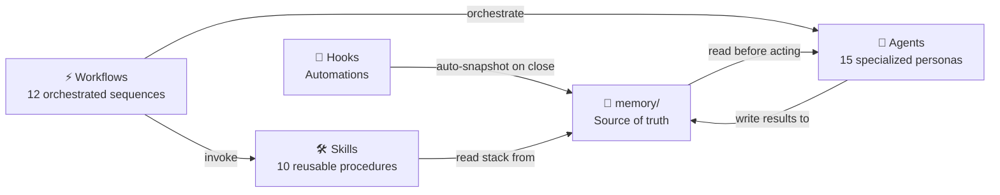

# ai-dev-framework

> Personal AI-assisted development framework — v3

**Author:** [KillianPiccerelle](https://github.com/KillianPiccerelle)
**Version:** 3.0.0

---

A framework that turns Claude Code into a structured development team. Instead of writing prompts from scratch every time, you invoke specialized agents and pre-defined workflows that cover every phase of a project — from initial scoping to shipping.

---

## Table of contents

- [Quick start](#quick-start)
- [Core concepts](#core-concepts)
- [Agents](#agents)
- [Workflows](#workflows)
- [Skills](#skills)
- [Memory system](#memory-system)
- [Templates](#templates)
- [Integrating into an existing project](#integrating-into-an-existing-project)
- [Keeping the framework up to date](#keeping-the-framework-up-to-date)
- [Contributing](#contributing)

---

## Quick start

### Install the framework (once)

```bash
git clone https://github.com/KillianPiccerelle/ai-dev-framework.git ~/ai-dev-framework
cd ~/ai-dev-framework && chmod +x scripts/install.sh && ./scripts/install.sh
```

> **`scripts/install.sh`** installs all 15 agents into `~/.claude/agents/`, all skills into `~/.claude/skills/`, and creates the global `ai-framework` command. Run once — all your projects share the same installation.

### New project from scratch

```bash
cd my-project
ai-framework init [template]
claude
/new-project
```

The `[template]` argument is **optional**. It pre-configures your `CLAUDE.md` with rules specific to your project type. If you skip it, the framework auto-detects your project type from `package.json`, `pyproject.toml`, or other configuration files and suggests the appropriate template. If detection fails, a minimal `CLAUDE.md` is generated.

| Template | Use when... |
|----------|-------------|
| `saas` | Building a multi-tenant SaaS with organizations and billing |
| `api-backend` | Building a pure REST/GraphQL API |
| `fullstack-web` | Building a fullstack web application (frontend + backend) |
| `ai-app` | Building an application with LLM features |
| *(none)* | Your project doesn't fit any category, or you prefer to start minimal |

---

## Global commands

Once installed, the `ai-framework` command is available globally:

| Command | Description |
|---------|-------------|
| `ai-framework init [template]` | Initialize the framework in the current project |
| `ai-framework update` | Update the framework to the latest version |
| `ai-framework install` | Re-run global installation |
| `ai-framework version` | Show version and check for updates |
| `ai-framework version check` | Silent check for CI/CD (returns exit codes) |
| `ai-framework version set <version>` | Update version file (release process) |

### Existing project

```bash
cd my-existing-project
ai-framework init
claude
/analyze-project
```

See [Integrating into an existing project](#integrating-into-an-existing-project) for a detailed step-by-step guide.

---

## Core concepts

The framework is built around four primitives that work together.

**Agents** are specialized AI personas, each with a defined role, a specific set of tools, and strict constraints on what they can and cannot do. An agent reads the project memory before acting, produces a specific output, and respects the established conventions. For example, the `architect` agent designs architecture and produces ADRs — it never writes implementation code. The `code-reviewer` agent audits code in read-only mode — it never modifies files.

**Workflows** are orchestrated sequences that chain agents together in the right order for a given task. A workflow like `/add-feature` calls `architect` to check ADR consistency, then `test-engineer` to write tests first, then `backend-dev` or `frontend-dev` to implement, then `code-reviewer` to audit, and finally `verifier` to validate. You invoke one command and the entire cycle runs.

**Skills** are reusable technical procedures invokable via slash command. Where workflows orchestrate agents, skills encode specific know-how: how to implement JWT authentication, how to design a normalized database schema, how to apply TDD. A skill reads `memory/stack.md` first and adapts its output to the project's actual tech stack.

**Memory** is the single source of truth for the project. It is a set of Markdown files that agents read before every action. It contains the project context, the technical stack and its justifications, the architecture, the coding conventions, and the architectural decisions (ADRs). Memory makes Claude consistent across sessions — it never starts from scratch.



---

## Agents

| Agent | Role | Model | Mode |
|-------|------|-------|------|
| `orchestrator` | Coordinates all other agents, follows the active workflow, never codes | sonnet | active |
| `architect` | Designs architecture, produces ADRs and ASCII data flow diagrams, never codes | opus | active |
| `stack-advisor` | Recommends the right technical stack based on project constraints, produces `memory/stack.md` | sonnet | active |
| `project-analyzer` | Analyzes an existing codebase to generate all `memory/` files automatically | opus | active |
| `codebase-analyst` | Deep repository analysis — detects patterns, conventions, dependencies, quality signals — supports other agents | sonnet | read-only |
| `backend-dev` | Implements API endpoints, business logic, database access. Works TDD only | sonnet | active |
| `frontend-dev` | Implements UI components, state management. Works TDD only | sonnet | active |
| `debug` | Finds root cause before fixing any bug. Follows a strict 5-step investigation process | sonnet | active |
| `test-engineer` | Writes tests before implementation (RED phase), applies TDD, targets 80%+ coverage | sonnet | active |
| `qa-engineer` | Advanced testing — detects edge cases, security vulnerabilities, uncovered code paths | sonnet | active |
| `code-reviewer` | Read-only code audit — lists BLOCKING / IMPORTANT / SUGGESTION issues, never modifies files | sonnet | read-only |
| `doc-writer` | Creates and updates README, API docs, guides. Documents what exists, never what is planned | sonnet | active |
| `verifier` | Fast validation checklist — tests pass, coverage ok, no TODO, docs up to date | haiku | read-only |
| `security-reviewer` | Read-only security audit — injections, auth bypass, IDOR, exposed secrets, attack surfaces. Produces `docs/security-report.md` with findings by severity | opus | read-only |
| `devops-engineer` | Generates Dockerfiles (multi-stage, non-root), GitHub Actions CI pipelines, and `.env.example`. Reads `memory/stack.md` to adapt to the detected stack | sonnet | active |

---

## Workflows

Workflows are invoked as slash commands from `.claude/commands/`. Each one defines which agents are involved, in which order, and which memory files are updated.

| Workflow | Command | What it does |
|----------|---------|--------------|
| New project | `/new-project` | Scoping (6 questions), stack choice, architecture design, conventions, project structure. Produces all `memory/` files. Validates with user at each step. |
| Analyze project | `/analyze-project` | Analyzes an existing codebase. Migrates old `CLAUDE.md` to `CLAUDE.backup.md`. Generates missing `memory/` files without overwriting existing ones. Non-destructive. |
| Map project | `/map-project` | Full codebase cartography — modules, services, dependencies, entry points, patterns. Produces `docs/project-map.md`. |
| Add feature | `/add-feature` | Full TDD cycle: impact analysis → tests first (RED) → implementation (GREEN) → refactoring → code review → QA → documentation → validation. |
| Debug issue | `/debug-issue` | Root cause mandatory before any fix. Reproduce → trace → formulate 3 hypotheses → test → fix. The reproduction test becomes a permanent regression test. |
| Refactor | `/refactor` | Safe incremental refactoring. Tests must pass before starting. Analyze → plan → validate → execute in small atomic commits. |
| Generate tests | `/gen-tests` | Coverage audit first, then targeted generation on uncovered areas. Respects current behavior. Never modifies source code to make tests pass. |
| Project status | `/project-status` | Health and progress report with timestamped history — test coverage, TODO count, ADR count, recent changes, ASCII progress charts. Generates `docs/status-YYYY-MM-DD.md` and keeps last 10 reports. |
| Upgrade framework | `/upgrade-framework` | Non-destructive migration from an older version. Detects existing config, backs it up, installs missing agents and workflows, merges memory. |
| Security audit | `/security-audit` | Full security audit: codebase mapping → security-reviewer → QA cross-check. Produces `docs/security-report.md` with findings classified critical/high/medium/low. |
| Setup CI | `/setup-ci` | Reads `memory/stack.md` and generates GitHub Actions CI pipeline, Dockerfile, `.env.example`, and optional deployment config (Railway, Fly.io, Vercel). |
| Onboard | `/onboard` | Reads all `memory/` files and generates `docs/onboarding.md` — a complete getting-started guide for a new developer joining the project. |

---

## Skills

Skills encode reusable technical know-how invokable via slash command. Each skill reads `memory/stack.md` first and adapts its output to the project's actual stack.

| Skill | Command | What it produces |
|-------|---------|-----------------|
| Stack advisor | `/stack-advisor` | Analyzes project constraints and produces `memory/stack.md` with justified technology choices and rejected alternatives |
| JWT authentication | `/jwt-auth` | Login, refresh token, logout endpoints + validation middleware. Includes a full test list to write before implementing |
| REST CRUD | `/rest-crud` | Complete CRUD endpoint with cursor-based pagination, uniform error format, input validation, permission checks |
| Database schema | `/schema-design` | Normalized schema design (3NF), UUID primary keys, soft delete, ASCII relationship diagram |
| TDD workflow | `/tdd-workflow` | RED → GREEN → REFACTOR cycle with coverage targets and end-of-cycle verification checklist |
| Docker setup | `/docker-setup` | Generates Dockerfile (multi-stage, non-root, health check) + docker-compose.yml + .dockerignore adapted to the project stack |
| Env setup | `/env-setup` | Scans all source files for environment variable references and generates a complete, commented `.env.example` grouped by concern |
| API docs | `/api-docs` | Generates OpenAPI 3.0 documentation from existing routes, adapted to the detected HTTP framework (Fastify, Express, FastAPI, NestJS) |
| oh-my-mermaid | `/oh-my-mermaid` | Generates interactive architecture diagrams by scanning the codebase. Provides scan, push (cloud), and view (local viewer) modes |
| code-review-graph | `/code-review-graph` | Analyzes codebase structure to identify minimal impacted files for reviews. 6.8× token reduction via dependency graph analysis |

> **Roadmap**: Additional skills planned for future releases include integration with more external plugins and tools.

---

## Memory system

The `memory/` folder is the project's knowledge base. Every agent reads it before acting. It persists across sessions — Claude never starts from scratch on a project that has memory files.

```
memory/
├── project-context.md   → objective, users, scope, constraints
├── stack.md             → technology choices with justifications
├── architecture.md      → architectural pattern, components, data flows
├── progress.md          → current status, what's done, what's next
├── decisions/           → ADRs (Architecture Decision Records)
├── conventions/         → naming, error handling, commit format
└── domain/              → business glossary, rules, personas
```

`decisions/` and `domain/` start empty and fill up as the project evolves. A session-save hook automatically writes a snapshot to `progress.md` every time Claude Code closes — memory is never lost between sessions.

---

## Templates

Templates are used **only when starting a project from scratch**. Each one provides a preconfigured `CLAUDE.md` with project-type-specific rules already in place.

If your project is already in progress, skip this section and go to [Integrating into an existing project](#integrating-into-an-existing-project) — the `/analyze-project` workflow generates a tailored `CLAUDE.md` from your actual codebase instead.

| Template | Command | Specific rules included |
|----------|---------|------------------------|
| `saas` | `ai-framework init saas` | Multi-tenancy (tenant_id on every query), billing (no card data, webhook-based sync), organization membership with roles |
| `api-backend` | `ai-framework init api-backend` | API versioning (/v1/), breaking change policy, rate limiting on public routes |
| `fullstack-web` | `ai-framework init fullstack-web` | Shared types in `shared/`, centralized API calls, global state scope |
| `ai-app` | `ai-framework init ai-app` | Prompts as versioned code, centralized LLM service layer, cost tracking, streaming with fallback, evals required before ship |
| *(none)* | `ai-framework init` | Minimal setup — memory templates and workflows only, no preset rules |

---

## Integrating into an existing project

This is the most common use case — you have a project already in progress and want Claude Code to understand it deeply before helping you work on it.

### Step 1 — Install the framework globally (once)

If not already done, follow the [Quick start](#quick-start) section to clone the repo and run `install.sh`. This is a one-time setup — all your projects share the same agents and skills.

### Step 2 — Initialize the framework in your project

```bash
cd your-existing-project
ai-framework init
```

This is **non-destructive** — it never modifies your source code, never overwrites your existing files. What it does:
- Creates a `memory/` folder with empty template files
- Copies the 12 workflows into `.claude/commands/` so Claude Code can invoke them
- If a `CLAUDE.md` already exists, it backs it up as `CLAUDE.backup.md` before generating a new one
- Creates `.claude/settings.json` if it doesn't exist

> No template argument here — for existing projects, the template is irrelevant. The `/analyze-project` workflow will generate a `CLAUDE.md` tailored to your actual codebase in the next step.

### Step 3 — Let Claude analyze your project

```bash
claude
```

Once Claude Code is open, type:

```
/analyze-project
```

> **`/analyze-project`** is for projects that don't have a `memory/` folder yet.
> If your project already has a `memory/` folder from a previous framework install, use `/upgrade-framework` instead — it merges your existing memory with the latest structure rather than generating from scratch.

Claude will read your entire codebase and automatically generate:
- `memory/project-context.md` — what your project does, who it's for
- `memory/stack.md` — your detected tech stack with justifications
- `memory/architecture.md` — the architectural pattern and main components
- `memory/conventions/` — your naming conventions, error handling style, commit format

At the end, it presents a summary of everything generated so you can review and correct anything that was misdetected.

### Step 4 — Review and complete the memory files

Open `memory/project-context.md` and verify the generated content. Claude does its best to infer from your code, but some things — like business context, target users, or non-functional constraints — can only come from you. Fill in any placeholders.

### Step 5 — Start working

From this point, Claude has full context about your project. Use the workflows for every task:

```
/add-feature     → implement something new with full TDD
/debug-issue     → investigate and fix a bug
/map-project     → generate a full architecture map
/project-status  → get a health report
```

Every agent will read `memory/` before acting — no more re-explaining your stack or conventions at the start of each session.

---

## Keeping the framework up to date

When new agents, workflows, or skills are added to the framework, update your global installation. Your project files are never touched.

### Update the framework

```bash
ai-framework update
```

The script pulls the latest changes from GitHub, shows you what changed, and refreshes all agents, skills, and hooks globally.

> Your project files, `memory/` contents, and custom configurations are **never modified**.

### Update a specific project's workflows

The global update refreshes agents and skills but does not touch the workflows in your projects' `.claude/commands/`. To get the latest workflows in a project:

```bash
cd your-project
ai-framework init
```

Then in Claude Code:

```
/upgrade-framework
```

This installs only missing workflows — your customized ones are preserved.

---

## Documentation

- [Documentation française](docs/fr/README.md)

## Contributing

Contributions welcome. Open an issue or a pull request.

## License

MIT — [KillianPiccerelle](https://github.com/KillianPiccerelle)