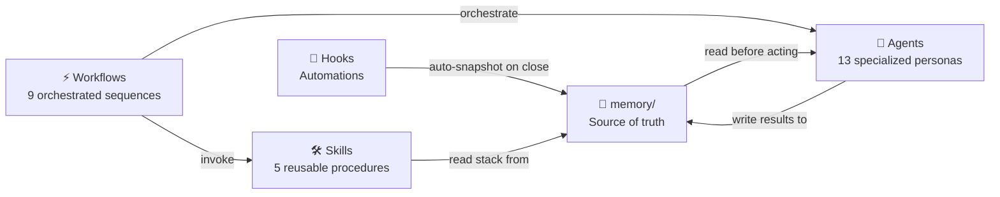

# ai-dev-framework

> Personal AI-assisted development framework — v3

**Author:** [KillianPiccerelle](https://github.com/KillianPiccerelle)
**Version:** 3.0.0

---

A framework that turns Claude Code into a structured development team. Instead of writing prompts from scratch every time, you invoke specialized agents and pre-defined workflows that cover every phase of a project — from initial scoping to shipping.

---

## Quick start

**New project:**
```bash
git clone https://github.com/KillianPiccerelle/ai-dev-framework.git ~/ai-dev-framework
cd ~/ai-dev-framework && chmod +x scripts/install.sh && ./scripts/install.sh

cd my-project
~/ai-dev-framework/scripts/init-project.sh saas
claude
/new-project
```

**Existing project:**
```bash
cd my-existing-project
~/ai-dev-framework/scripts/init-project.sh
claude
/analyze-project
```

> **`scripts/install.sh`** — run once globally. Installs all 13 agents into `~/.claude/agents/` and all skills into `~/.claude/skills/`.
> 
> **`scripts/init-project.sh`** — run per project. Detects existing Claude configuration and runs in update mode — nothing is overwritten.

---

## Core concepts

The framework is built around four primitives that work together.

**Agents** are specialized AI personas, each with a defined role, a specific set of tools, and strict constraints on what they can and cannot do. An agent reads the project memory before acting, produces a specific output, and respects the established conventions. For example, the `architect` agent designs architecture and produces ADRs — it never writes implementation code. The `code-reviewer` agent audits code in read-only mode — it never modifies files.

**Workflows** are orchestrated sequences that chain agents together in the right order for a given task. A workflow like `/add-feature` calls `architect` to check ADR consistency, then `test-engineer` to write tests first, then `backend-dev` or `frontend-dev` to implement, then `code-reviewer` to audit, and finally `verifier` to validate. You invoke one command and the entire cycle runs.

**Skills** are reusable technical procedures invokable via slash command. Where workflows orchestrate agents, skills encode specific know-how: how to implement JWT authentication, how to design a normalized database schema, how to apply TDD. A skill reads `memory/stack.md` first and adapts its output to the project's actual tech stack.

**Memory** is the single source of truth for the project. It is a set of Markdown files that agents read before every action. It contains the project context, the technical stack and its justifications, the architecture, the coding conventions, and the architectural decisions (ADRs). Memory makes Claude consistent across sessions — it never starts from scratch.



---

## Agents

| Agent | Role | Model | Mode |
|-------|------|-------|------|
| `orchestrator` | Coordinates all other agents, follows the active workflow, never codes | sonnet | active |
| `architect` | Designs architecture, produces ADRs and ASCII data flow diagrams, never codes | opus | active |
| `stack-advisor` | Recommends the right technical stack based on project constraints, produces `memory/stack.md` | sonnet | active |
| `project-analyzer` | Analyzes an existing codebase to generate all `memory/` files automatically | opus | active |
| `codebase-analyst` | Deep repository analysis — detects patterns, conventions, dependencies, quality signals — supports other agents | sonnet | read-only |
| `backend-dev` | Implements API endpoints, business logic, database access. Works TDD only | sonnet | active |
| `frontend-dev` | Implements UI components, state management. Works TDD only | sonnet | active |
| `debug` | Finds root cause before fixing any bug. Follows a strict 5-step investigation process | sonnet | active |
| `test-engineer` | Writes tests before implementation (RED phase), applies TDD, targets 80%+ coverage | sonnet | active |
| `qa-engineer` | Advanced testing — detects edge cases, security vulnerabilities, uncovered code paths | sonnet | active |
| `code-reviewer` | Read-only code audit — lists BLOCKING / IMPORTANT / SUGGESTION issues, never modifies files | sonnet | read-only |
| `doc-writer` | Creates and updates README, API docs, guides. Documents what exists, never what is planned | sonnet | active |
| `verifier` | Fast validation checklist — tests pass, coverage ok, no TODO, docs up to date | haiku | read-only |

---

## Workflows

Workflows are invoked as slash commands from `.claude/commands/`. Each one defines which agents are involved, in which order, and which memory files are updated.

| Workflow | Command | What it does |
|----------|---------|--------------|
| New project | `/new-project` | Scoping (6 questions), stack choice, architecture design, conventions, project structure. Produces all `memory/` files. Validates with user at each step. |
| Analyze project | `/analyze-project` | Analyzes an existing codebase. Migrates old `CLAUDE.md` to `CLAUDE.backup.md`. Generates missing `memory/` files without overwriting existing ones. Non-destructive. |
| Map project | `/map-project` | Full codebase cartography — modules, services, dependencies, entry points, patterns. Produces `docs/project-map.md`. |
| Add feature | `/add-feature` | Full TDD cycle: impact analysis → tests first (RED) → implementation (GREEN) → refactoring → code review → QA → documentation → validation. |
| Debug issue | `/debug-issue` | Root cause mandatory before any fix. Reproduce → trace → formulate 3 hypotheses → test → fix. The reproduction test becomes a permanent regression test. |
| Refactor | `/refactor` | Safe incremental refactoring. Tests must pass before starting. Analyze → plan → validate → execute in small atomic commits. |
| Generate tests | `/gen-tests` | Coverage audit first, then targeted generation on uncovered areas. Respects current behavior. Never modifies source code to make tests pass. |
| Project status | `/project-status` | Health and progress report — test coverage, TODO count, ADR count, last session summary, recommended next action. Read-only. |
| Upgrade framework | `/upgrade-framework` | Non-destructive migration from an older version. Detects existing config, backs it up, installs missing agents and workflows, merges memory. |

---

## Skills

Skills encode reusable technical know-how invokable via slash command. Each skill reads `memory/stack.md` first and adapts its output to the project's actual stack.

| Skill | Command | What it produces |
|-------|---------|-----------------|
| Stack advisor | `/stack-advisor` | Analyzes project constraints and produces `memory/stack.md` with justified technology choices and rejected alternatives |
| JWT authentication | `/jwt-auth` | Login, refresh token, logout endpoints + validation middleware. Includes a full test list to write before implementing |
| REST CRUD | `/rest-crud` | Complete CRUD endpoint with cursor-based pagination, uniform error format, input validation, permission checks |
| Database schema | `/schema-design` | Normalized schema design (3NF), UUID primary keys, soft delete, ASCII relationship diagram |
| TDD workflow | `/tdd-workflow` | RED → GREEN → REFACTOR cycle with coverage targets and end-of-cycle verification checklist |

---

## Memory system

The `memory/` folder is the project's knowledge base. Every agent reads it before acting. It persists across sessions — Claude never starts from scratch on a project that has memory files.

```
memory/
├── project-context.md   → objective, users, scope, constraints
├── stack.md             → technology choices with justifications
├── architecture.md      → architectural pattern, components, data flows
├── progress.md          → current status, what's done, what's next
├── decisions/           → ADRs (Architecture Decision Records)
├── conventions/         → naming, error handling, commit format
└── domain/              → business glossary, rules, personas
```

`decisions/` and `domain/` start empty and fill up as the project evolves. A session-save hook automatically writes a snapshot to `progress.md` every time Claude Code closes — memory is never lost between sessions.

---

## Templates

Templates are used only when starting a project from scratch. Each one provides a preconfigured `CLAUDE.md` with project-type-specific rules already in place. For existing projects, use `/analyze-project` instead — it generates a tailored `CLAUDE.md` from the actual codebase.

| Template | Command | Specific rules included |
|----------|---------|------------------------|
| `saas` | `init-project.sh saas` | Multi-tenancy (tenant_id on every query), billing (no card data, webhook-based sync), organization membership with roles |
| `api-backend` | `init-project.sh api-backend` | API versioning (/v1/), breaking change policy, rate limiting on public routes |
| `fullstack-web` | `init-project.sh fullstack-web` | Shared types in `shared/`, centralized API calls, global state scope |
| `ai-app` | `init-project.sh ai-app` | Prompts as versioned code, centralized LLM service layer, cost tracking, streaming with fallback, evals required before ship |

---

## Documentation

- [Documentation française](docs/fr/README.md)

## Contributing

Contributions welcome. Open an issue or a pull request.

## License

MIT — [KillianPiccerelle](https://github.com/KillianPiccerelle)