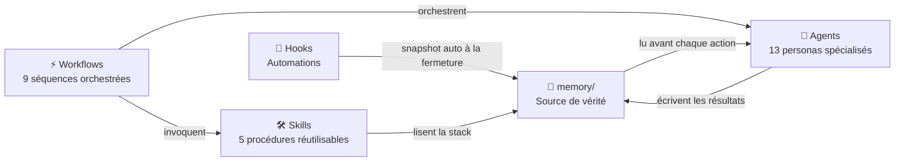

# ai-dev-framework

> Framework personnel de développement assisté par IA — v3

**Auteur :** [KillianPiccerelle](https://github.com/KillianPiccerelle)
**Version :** 3.0.0

---

Un framework qui transforme Claude Code en équipe de développement structurée. Au lieu d'écrire des prompts depuis zéro à chaque fois, tu invoques des agents spécialisés et des workflows prédéfinis qui couvrent chaque phase d'un projet — du cadrage initial jusqu'au déploiement.

---

## Démarrage rapide

**Nouveau projet :**
```bash
git clone https://github.com/KillianPiccerelle/ai-dev-framework.git ~/ai-dev-framework
cd ~/ai-dev-framework && chmod +x scripts/install.sh && ./scripts/install.sh

cd mon-projet
~/ai-dev-framework/scripts/init-project.sh saas
claude
/new-project
```

**Projet existant :**
```bash
cd mon-projet-existant
~/ai-dev-framework/scripts/init-project.sh
claude
/analyze-project
```

> **`scripts/install.sh`** — à lancer une seule fois globalement. Installe les 13 agents dans `~/.claude/agents/` et tous les skills dans `~/.claude/skills/`.
> 
> **`scripts/init-project.sh`** — à lancer par projet. Détecte une configuration Claude existante et passe en mode mise à jour — rien n'est écrasé.

---

## Concepts fondamentaux

Le framework est construit autour de quatre primitives qui fonctionnent ensemble.

**Les agents** sont des personas IA spécialisés, chacun avec un rôle défini, un ensemble d'outils spécifiques, et des contraintes strictes sur ce qu'ils peuvent ou ne peuvent pas faire. Un agent lit la mémoire du projet avant d'agir, produit un output précis, et respecte les conventions établies. Par exemple, l'agent `architect` conçoit l'architecture et produit des ADRs — il n'écrit jamais de code d'implémentation. L'agent `code-reviewer` audite le code en lecture seule — il ne modifie jamais de fichiers.

**Les workflows** sont des séquences orchestrées qui enchaînent les agents dans le bon ordre pour une tâche donnée. Un workflow comme `/add-feature` appelle `architect` pour vérifier la cohérence avec les ADRs, puis `test-engineer` pour écrire les tests en premier, puis `backend-dev` ou `frontend-dev` pour implémenter, puis `code-reviewer` pour auditer, et enfin `verifier` pour valider. Tu invoques une commande et tout le cycle s'exécute.

**Les skills** sont des procédures techniques réutilisables invocables par slash command. Là où les workflows orchestrent des agents, les skills encodent un savoir-faire spécifique : comment implémenter une authentification JWT, comment concevoir un schéma de base de données normalisé, comment appliquer TDD. Un skill lit `memory/stack.md` en premier et adapte son output à la stack réelle du projet.

**La mémoire** est la source unique de vérité du projet. C'est un ensemble de fichiers Markdown que les agents lisent avant chaque action. Elle contient le contexte du projet, la stack technique et ses justifications, l'architecture, les conventions de code, et les décisions architecturales (ADRs). La mémoire rend Claude cohérent entre les sessions — il ne repart jamais de zéro.



---

## Agents

| Agent | Rôle | Modèle | Mode |
|-------|------|--------|------|
| `orchestrator` | Coordonne tous les autres agents, suit le workflow actif, ne code jamais | sonnet | actif |
| `architect` | Conçoit l'architecture, produit des ADRs et des diagrammes ASCII, ne code jamais | opus | actif |
| `stack-advisor` | Recommande la stack adaptée aux contraintes du projet, produit `memory/stack.md` | sonnet | actif |
| `project-analyzer` | Analyse un codebase existant pour générer automatiquement tous les fichiers `memory/` | opus | actif |
| `codebase-analyst` | Analyse profonde du repo — patterns, conventions, dépendances, signaux qualité — supporte les autres agents | sonnet | lecture seule |
| `backend-dev` | Implémente les endpoints API, la logique métier, les accès base de données. TDD uniquement | sonnet | actif |
| `frontend-dev` | Implémente les composants UI, la gestion d'état. TDD uniquement | sonnet | actif |
| `debug` | Trouve la cause racine avant de corriger tout bug. Processus d'investigation en 5 étapes obligatoires | sonnet | actif |
| `test-engineer` | Écrit les tests avant l'implémentation (phase RED), applique TDD, cible 80%+ de couverture | sonnet | actif |
| `qa-engineer` | Tests avancés — détecte les edge cases, vulnérabilités de sécurité, chemins de code non couverts | sonnet | actif |
| `code-reviewer` | Audit de code en lecture seule — liste les problèmes BLOQUANT / IMPORTANT / SUGGESTION, ne modifie jamais de fichiers | sonnet | lecture seule |
| `doc-writer` | Crée et met à jour README, docs API, guides. Documente ce qui existe, jamais ce qui est prévu | sonnet | actif |
| `verifier` | Checklist de validation rapide — tests passent, couverture ok, pas de TODO, docs à jour | haiku | lecture seule |

---

## Workflows

Les workflows sont invoqués comme slash commands depuis `.claude/commands/`. Chacun définit quels agents sont impliqués, dans quel ordre, et quels fichiers mémoire sont mis à jour.

| Workflow | Commande | Ce qu'il fait |
|----------|----------|--------------|
| Nouveau projet | `/new-project` | Cadrage (6 questions), choix de stack, conception architecture, conventions, structure projet. Produit tous les fichiers `memory/`. Valide avec l'utilisateur à chaque étape. |
| Analyser un projet | `/analyze-project` | Analyse un codebase existant. Migre l'ancien `CLAUDE.md` en `CLAUDE.backup.md`. Génère les fichiers `memory/` manquants sans écraser les existants. Non-destructif. |
| Cartographier | `/map-project` | Cartographie complète du codebase — modules, services, dépendances, points d'entrée, patterns. Produit `docs/project-map.md`. |
| Ajouter une feature | `/add-feature` | Cycle TDD complet : analyse d'impact → tests d'abord (RED) → implémentation (GREEN) → refactoring → code review → QA → documentation → validation. |
| Déboguer | `/debug-issue` | Cause racine obligatoire avant tout fix. Reproduire → tracer → formuler 3 hypothèses → tester → corriger. Le test de reproduction devient un test de régression permanent. |
| Refactoriser | `/refactor` | Refactoring incrémental sécurisé. Les tests doivent passer avant de commencer. Analyser → planifier → valider → exécuter en petits commits atomiques. |
| Générer des tests | `/gen-tests` | Audit de couverture d'abord, puis génération ciblée sur les zones non couvertes. Respecte le comportement actuel. Ne modifie jamais le code source pour faire passer les tests. |
| Statut du projet | `/project-status` | Rapport de santé et de progression — couverture de tests, nombre de TODO, nombre d'ADRs, résumé de la dernière session, prochaine action recommandée. Lecture seule. |
| Mettre à jour | `/upgrade-framework` | Migration non-destructive depuis une ancienne version. Détecte la config existante, la sauvegarde, installe les agents et workflows manquants, fusionne la mémoire. |

---

## Skills

Les skills encodent un savoir-faire technique réutilisable invocable par slash command. Chaque skill lit `memory/stack.md` en premier et adapte son output à la stack réelle du projet.

| Skill | Commande | Ce qu'il produit |
|-------|----------|-----------------|
| Stack advisor | `/stack-advisor` | Analyse les contraintes du projet et produit `memory/stack.md` avec les choix technologiques justifiés et les alternatives rejetées |
| Authentification JWT | `/jwt-auth` | Endpoints login, refresh token, logout + middleware de validation. Inclut une liste complète de tests à écrire avant d'implémenter |
| REST CRUD | `/rest-crud` | Endpoint CRUD complet avec pagination cursor-based, format d'erreur uniforme, validation des inputs, vérification des permissions |
| Schéma de base de données | `/schema-design` | Conception de schéma normalisé (3NF), clés primaires UUID, soft delete, diagramme ASCII des relations |
| Workflow TDD | `/tdd-workflow` | Cycle RED → GREEN → REFACTOR avec objectifs de couverture et checklist de vérification en fin de cycle |

---

## Système de mémoire

Le dossier `memory/` est la base de connaissance du projet. Chaque agent le lit avant d'agir. Il persiste entre les sessions — Claude ne repart jamais de zéro sur un projet qui a des fichiers mémoire.

```
memory/
├── project-context.md   → objectif, utilisateurs, périmètre, contraintes
├── stack.md             → choix technologiques avec justifications
├── architecture.md      → pattern architectural, composants, flux de données
├── progress.md          → état courant, ce qui est fait, prochaines étapes
├── decisions/           → ADRs (Architecture Decision Records)
├── conventions/         → nommage, gestion des erreurs, format de commits
└── domain/              → glossaire métier, règles, personas
```

`decisions/` et `domain/` démarrent vides et se remplissent au fil du projet. Un hook de fin de session écrit automatiquement un snapshot dans `progress.md` à chaque fermeture de Claude Code — la mémoire n'est jamais perdue entre les sessions.

---

## Templates

Les templates sont utilisés uniquement pour démarrer un projet de zéro. Chacun fournit un `CLAUDE.md` préconfiguré avec les règles spécifiques au type de projet déjà en place. Pour un projet existant, utiliser `/analyze-project` à la place — il génère un `CLAUDE.md` adapté à partir du codebase réel.

| Template | Commande | Règles spécifiques incluses |
|----------|----------|----------------------------|
| `saas` | `init-project.sh saas` | Multi-tenancy (tenant_id sur chaque requête), billing (pas de données de carte, sync par webhooks), appartenance à plusieurs organisations avec rôles |
| `api-backend` | `init-project.sh api-backend` | Versioning des routes (/v1/), politique de breaking changes, rate limiting sur les routes publiques |
| `fullstack-web` | `init-project.sh fullstack-web` | Types partagés dans `shared/`, appels API centralisés, scope de l'état global |
| `ai-app` | `init-project.sh ai-app` | Prompts comme code versionné, couche service LLM centralisée, cost tracking, streaming avec fallback, evals obligatoires avant ship |

---

## Configurer Claude Code pour ce framework

Copier les fichiers depuis `agents/` dans `~/.claude/agents/` pour les activer globalement.
Copier les fichiers depuis `workflows/` dans `.claude/commands/` du projet.

### Règles fondamentales à inclure dans ton CLAUDE.md

1. Lire `memory/` entièrement avant toute action.
2. Ne jamais contredire un ADR sans en créer un nouveau.
3. Toujours TDD : tests avant implémentation.
4. Valider avec l'agent `verifier` avant de clore une tâche.
5. Mettre à jour `memory/progress.md` en fin de session.
6. Après chaque erreur : "Mets à jour CLAUDE.md pour ne pas refaire cette erreur."

---

## Ajouter un agent

Créer `agents/mon-agent.md` avec ce format :

```markdown
---
name: mon-agent
description: >
  Description claire. Explique ce que fait l'agent, quand l'invoquer,
  et ce qu'il ne fait PAS. Cette description est lue par Claude pour
  décider si l'agent est pertinent pour une demande donnée.
tools: [Read, Write, Edit, Bash, Grep, Glob]
model: sonnet
readonly: false
---

Instructions système de l'agent...
```

**name** : identifiant unique, kebab-case, correspond au nom du fichier.

**description** : utilisée par Claude pour évaluer la pertinence. Doit répondre : quand l'invoquer, ce qu'il produit, ce qu'il évite.

**tools** : principe du moindre privilège — n'accorder que ce qui est nécessaire. Outils disponibles : Read, Write, Edit, Bash, Grep, Glob.

**model** : `opus` pour les tâches complexes, `sonnet` pour les tâches courantes, `haiku` pour les validations rapides.

**readonly** : `true` si l'agent ne doit jamais modifier de fichiers.

L'agent doit savoir quoi lire dans `memory/` avant d'agir, quoi produire et où le mettre, et avoir une règle claire sur ce qu'il ne fait pas.

---

## Licence

MIT — [KillianPiccerelle](https://github.com/KillianPiccerelle)